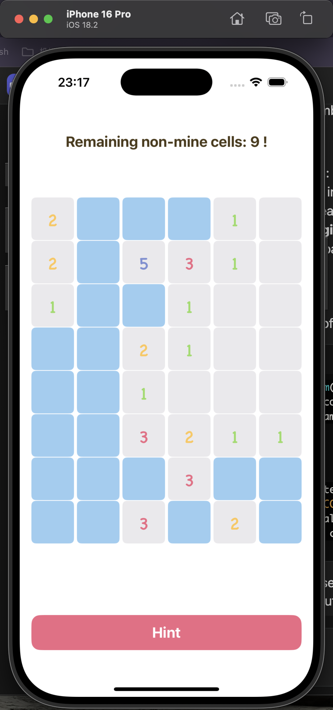
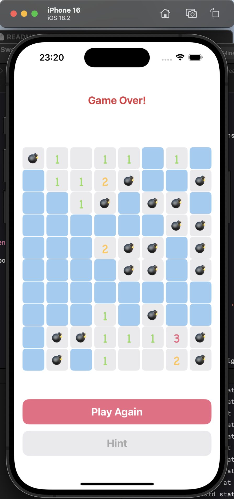

# MineSweeper

一个现代化的 iOS 扫雷游戏实现，基于清晰架构原则和响应式编程。

## 🎮 功能
- 三个难度级别：
  - 初学者（6x4 网格，2 个地雷）
  - 中级（8x6 网格，12 个地雷）
  - 专家（10x8 网格，20 个地雷）
- 提示功能
- 自动揭示空格
- 首次不踩雷

## 🏗 架构
该项目遵循 Clean 架构，具有明确的关注点分离：

### 领域层
核心业务逻辑层，与任何外部框架无关：
- **Entity**：核心业务模型，如 `Board` 和 `BoardCell`
- **UseCase**：业务逻辑实现：
  - `RevealCellUseCase`：处理格子揭示逻辑
  - `GetHintUseCase`：提供提示功能
  - `GetBoardStateUseCase`：管理游戏状态
- **Interface**：用于数据管理的仓库接口(暂未用到)

### 数据层
处理数据持久化和外部数据访问：
- **仓库**：实现数据存储和检索

### 表现层
使用 MVVM ：
- **ViewController**：UI 逻辑和用户输入处理
- **ViewModel**：状态管理和业务逻辑协调
- **视图**：自定义 UI 组件

### 依赖注入
- **GameAssembly**：管理依赖注入和组件组装

## 🛠 技术栈
- Swift
- UIKit
- Combine
- IGListKit
- SnapKit
- Clean 架构
- MVVM

## 📱 系统要求
- iOS 15.0+
- Xcode 12.0+
- Swift 5.0+

## 🔑 关键类说明

### AppContext
- **作用**：管理应用的环境配置和日志记录。
- **说明**：单例模式实现，提供开发、测试和生产环境的切换。

### GameAssembly
- **作用**：组装游戏视图控制器。
- **说明**：负责创建游戏所需的所有依赖项，包括视图模型和数据仓库。

### Board
- **作用**：表示游戏板。
- **说明**：管理格子的状态（如是否为地雷、是否被揭示等），并提供邻居格子的遍历方法。

### GameRepositoryImpl
- **作用**：实现游戏状态的持久化。
- **说明**：使用 `UserDefaults` 保存和加载游戏状态。

### CellModel
- **作用**：表示游戏中的每个格子。
- **说明**：实现 `ListDiffable` 协议，支持在列表中高效更新。

### DifficultyViewController
- **作用**：提供用户选择游戏难度的界面。
- **说明**：用户可以在此界面选择不同的难度级别，启动相应的游戏。

### MainButton
- **作用**：自定义按钮样式。
- **说明**：根据按钮的启用状态更新外观，提供一致的用户体验。

### RevealCellUseCase
- **作用**：处理格子的揭示逻辑。
- **说明**：根据用户的操作，更新格子的状态并检查游戏是否结束。

### GetHintUseCase
- **作用**：提供游戏提示功能。
- **说明**：根据当前游戏状态，返回一个提示，帮助用户找到安全的格子。

### GetBoardStateUseCase
- **作用**：管理游戏状态。
- **说明**：提供获取当前游戏状态的方法，支持游戏的保存和加载。

## 🚀 运行和安装说明
1. 克隆项目：
   ```sh
   git clone https://github.com/yourusername/minesweeper.git
   cd minesweeper
   ```
   
2.安装依赖项（使用 CocoaPods）：
   ```sh
   pod install
   ```
3.运行项目(Cmd + R)

## 🖼 截图


